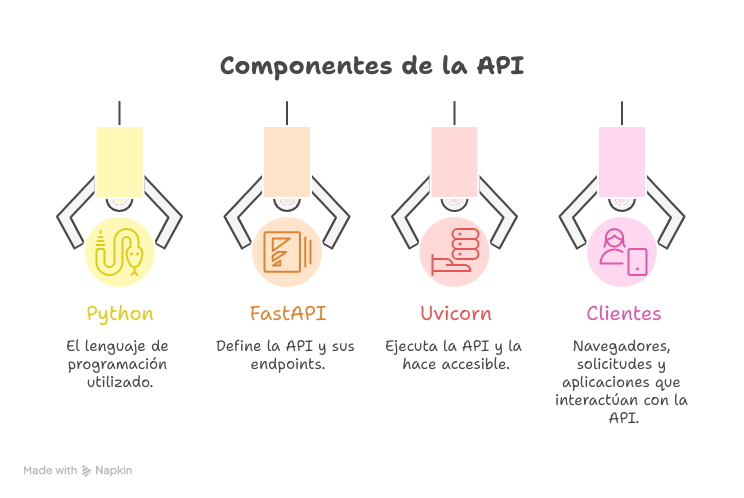

Python posee una biblioteca request, qye permite interactuar con las APIS

## *Requests (Python library)*  

*No crea apis, se usa para consumir o interactuar con apis*

`pip install request`

**Peticiones que puedo realizar**

* GET = Recupera datos

```
import requests

response = request.get('https://api.example.com/data')

data = response.json()
```

* POST = Envia instrucciones, por ejemplo: crear o actualizar un recurso (no recomendable)

```
# Data
data = {'name': 'Andre Doe', 'email':'a.doe@gmail.com}

response = request.post('https://api.example.com/users', json=data)

# Verifica respuesta - status code: 201 - creation

if response.status_code == 201:
    print("User created successfully!")
else:
    print("Error:", response.status_code)
```

* PUT =  Reemplaza

```
import requests

data = {'name': 'Andre Update', 'email':'a.doe@gmail.com}

response = requests.put('https://api.example.com/users/1', json = data)
```


* PATCH = Actualiza parcialmente

```
import requests

data = {'email':'newemail@gmail.com}

response = requests.path('https://api.example.com/users/1', json = data)
```

* DELETE = Borra un recurso

```
import requests

response = requests.delete('https://api.example.com/users/1')

```

## *FastAPI (Python library)* 

Framework de Python que se usa para crear APIs web de forma rápida

Configurar FastAPI
instalar FastAPI y Uvicorn (servidor ASGI de alto rendimiento)


`pip install fastapi uvicorn`


> Nota:
Uvicorn ejecuta la API y la hace accesible desde el navegador o desde otras aplicaciones.



Imagen de Napkin.AI

> Nota:
lanzar esta API  
>
>`uvicorn main:app --reload`

Para crear las apis, se usan los decoradores

* @app.get("/")     
* @app.post("/") 
* @app.put("/")    
* @app.patch("/") 
* @app.delete("/") 
def funcion_api():  # Función Python que se ejecuta cuando se llama este endpoint
    return {"mensaje": "Respuesta de la API"}
